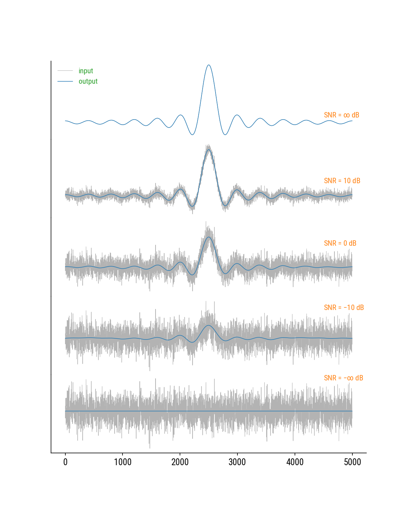

[](https://zenodo.org/badge/latestdoi/173396157)

# 1D Spectrum Denoiser
The Denoising algorithm is essentially derived from **singular value decomposition** (**SVD**).
By first constructing a **partial circulant matrix** using the spectral data, the noise components are discriminated after SVD of the matrix.
A smoother spectrum is reconstructed from a **low-rank approximation** of the matrix using only the signal components.

The code is completely written in `Python`, with numerical support by the standard packages `SciPy` and `NumPy`.
It offers two operational modes, i.e., _layman_ and _expert_.
In the layman mode, the code works out-of-the-box once a user has fed with an input spectrum.
Afterwards, it will autonomously produce the optimal smoothed spectrum.
Whereas with the expert mode, the user owns full control of the code.
He/She is able to fine-tune every denoising parameters during the process.
This can especially be useful in certain scenarios, e.g., debugging.

## Prerequisites
 - `Python 3`
 - `SciPy`, `NumPy`
 - `Matplotlib` (_optional, only if visualization is needed_)

## Inventory
**class** Denoiser(mode = _"layman"|"expert"_)

### attributes
 - mode: current running mode
 - s: singular values
 - U: left singular vectors
 - r: rank of the approximating matrix

### method
denoise(sequence, layer, gap, rank)
 - arguments
   * sequence: noisy data sequence
   * layer: number of rows of the constructed matrix
   * gap: (expected only in expert mode) boundary level difference of the sequence, right - left
   * rank: (expected only in expert mode) rank of the approximating matrix
 - return
   * denoised: smoothed sequence

## Example
Imagine now a clean _sinc signal_ is corrupted by an _additive Gaussian white noise_, which results in a noisy _sequence_ of length `5000`.
To denoise the sequence, we just need two lines.

``` python
denoiser = Denoiser() # instantiate the class
denoised_sequence = denoiser.denoise(sequence, 1000) # 1000 defines the number of rows of the constructed matrix
```

The denoising performance at different _signal-to-noise ratios_ (SNRs) is demonstrated in the figure below. 
Note that when the noise is absent, the signal is perfectly restored.
When the signal is absent, the noise mean is returned, which agrees with one's intuition.



## Reference
X.C. Chen _et al._, [_Phys. Rev. E_ **99**, 063320](https://doi.org/10.1103/PhysRevE.99.063320) (2019).

## License
This repository is licensed under the **GNU GPLv3**.
